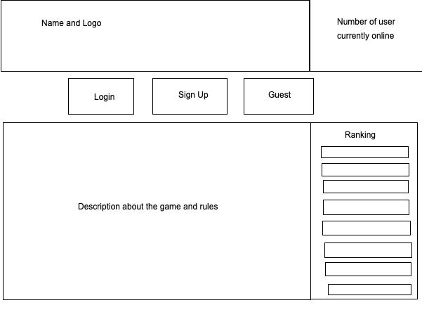

# Tic Tac Toe Game
Tictactoe an intellectual game that is very familiar to each of us. With simple gameplay but very high intellectual factor, playing tictactoe is loved by many people, especially students and office workers. Tictactoe is not only pure entertainment, but is a very intense game of mind. Join tictactoe game with your friends or colleagues to have fun moments together.
## Rule
- First player will start with X.
- Need to make three in a row to win.
- Player cannot play on a spot which already has been played.
## Technologies Used
- jQuery
- HTML
- CSS
  + Bootstraps
  + Flexbox
- Javascript
## Technical Description
#### User Path
- Users are able to create new accounts to login.
- Users are able to sign in with their accounts which have all their game history stored on the server.
- Users are able to change password or sign out when they want after signing in.
- Users are able to start a new game.
- Users are able to restart or quit when they are playing.
- Users are able to go back to previous screen where they can change password or sign out after quiting the game.
#### Game Path
- Users are able to start the game with X then rotate with O to play the game.
- Users are prohibited to play on a played spot on the table.
- Users are able to win if they get three in a row.
- Users are able to restart the game after they finish the game.
- Users are able to see number of total game played.
## Image
#### Wireframe

#### Demo

## Contributing
If you would like to fork this repo and add more to it, you will need to run these commands to get verything set up:
```
$ git clone git@github.com:clonehuy09/Project-1.git
$ cd Project-1
$ npm install
```
